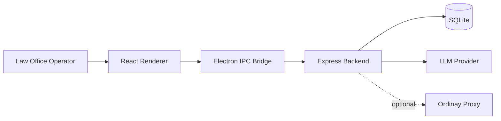

# Ordinay

[](LICENSE)


Ordinay is a desktop-first legal operations platform for law offices.  
It centralizes casework, dossiers, hearings, tasks, missions, documents, billing, and notifications, with an AI agent runtime designed for safety and operational control.

## Core Capabilities

- Client, dossier, and lawsuit lifecycle management.
- Task, mission, and session tracking with domain-aware workflows.
- Document management and legal document generation pipelines.
- Financial entry tracking linked to legal operations.
- Agent v2 streaming assistant with plan/confirm/execute safety model.

## System Architecture



## Requirements

- Node.js `20.19+` or `22.12+`
- npm `10+`

## Quick Start

1. Install dependencies.

```bash
npm ci
npm --prefix backend ci
npm --prefix frontend ci
npm --prefix ordinay-proxy ci
```

2. Configure backend environment.

```bash
cp backend/.env.example backend/.env
```

3. Configure frontend environment (optional overrides).

```bash
cp frontend/.env.example frontend/.env
```

4. Start backend.

```bash
npm --prefix backend run start
```

5. Start desktop frontend in development mode.

```bash
npm --prefix frontend run electron:dev
```

## Build

Build desktop application:

```bash
npm --prefix frontend run electron:build
```

Build optional proxy service:

```bash
npm --prefix ordinay-proxy run build
```

## Repository Layout

- `frontend/` Electron + React desktop UI.
- `backend/` Express API, domain logic, agent runtime, and persistence.
- `ordinay-proxy/` optional provider proxy layer for hosted deployments.
- `docs/` product, architecture, domain, and agent design documentation.

## Documentation Index

- [Project Vision](docs/PROJECT_VISION.md)
- [Architecture Diagrams](docs/ARCHITECTURE_DIAGRAMS.md)
- [App Logic Use Cases](docs/APP_LOGIC_USE_CASES.md)
- [Domain Model](docs/DOMAIN_MODEL.md)
- [Deep Technical Architecture](docs/ARCHITECTURE.md)
- [Agent System Design](docs/AGENT_SYSTEM_DESIGN.md)
- [Agent Diagrams](docs/AGENT_DIAGRAMS.md)
- [Agent Use Cases](docs/AGENT_USE_CASES.md)

## Contribution And Security

- Contributing guide: [CONTRIBUTING.md](CONTRIBUTING.md)
- Code of conduct: [CODE_OF_CONDUCT.md](CODE_OF_CONDUCT.md)
- Security policy: [SECURITY.md](SECURITY.md)

## License

This project is licensed under the MIT License. See [LICENSE](LICENSE).
