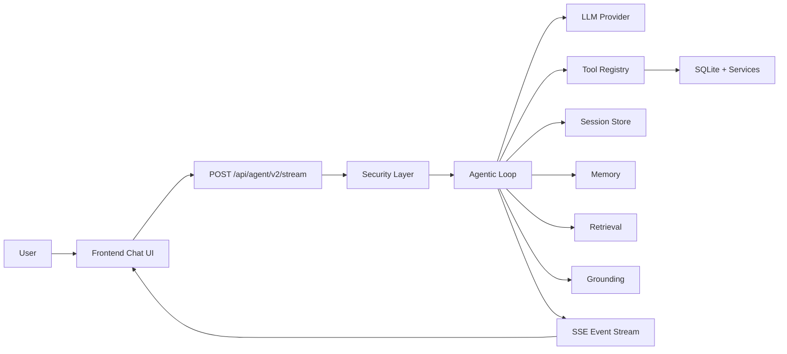
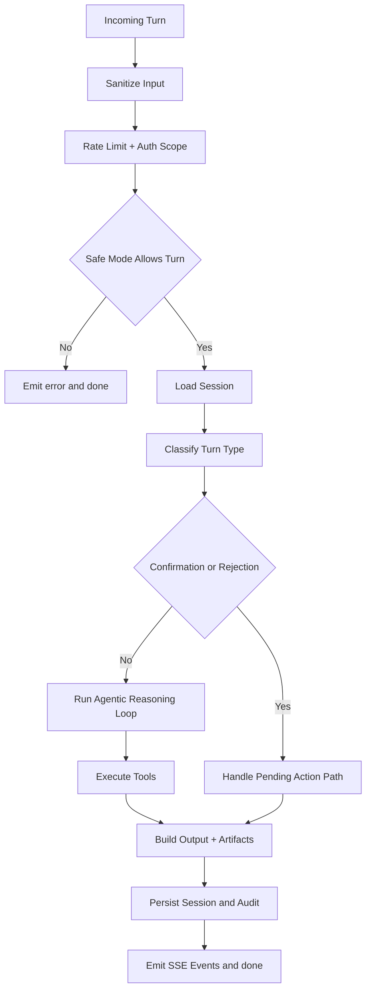
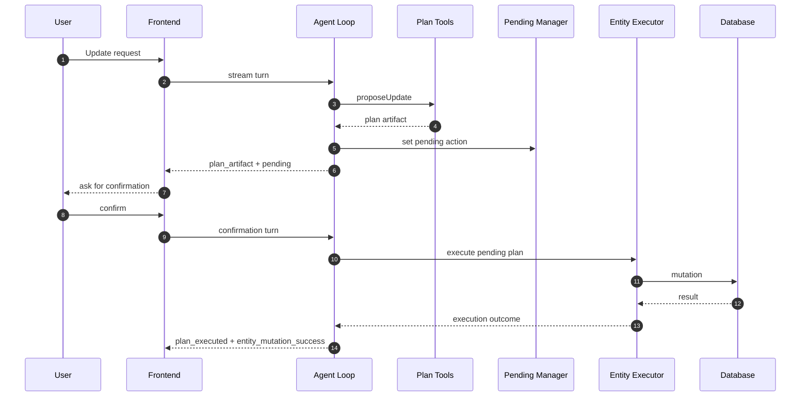
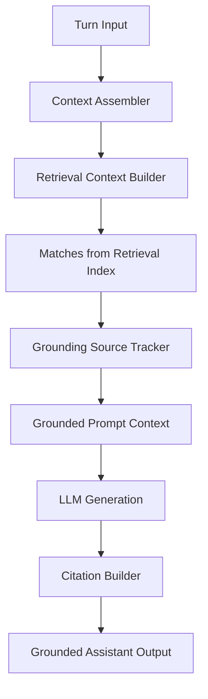
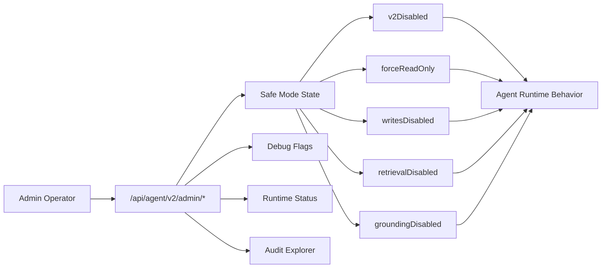

# Agent Diagrams

This file contains focused diagrams for the Agent v2 architecture.

## 1. Agent Runtime Context

## 2. Turn Lifecycle

## 3. Plan Confirm Execute Sequence

## 4. Retrieval and Grounding Pipeline

## 5. Operations and Safe Mode Control Plane

