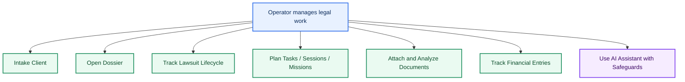
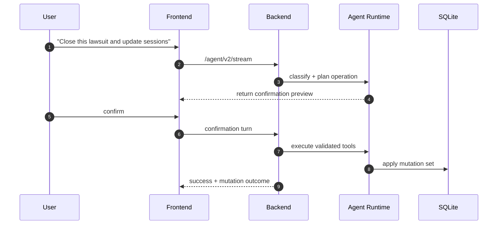

# App Logic Use Cases

## 1. Use Case Map

## 2. High-Value Use Cases

### UC1: Client Intake to Active Dossier

- Actor: Lawyer / legal operator
- Trigger: New client onboarding
- Main flow:
  1. Create `client`
  2. Open `dossier` linked to the client
  3. Add first tasks/sessions/documents
- Logic checkpoints:
  - Dossier must always reference an existing client
  - Dossier status and priority must stay within allowed states

### UC2: Dossier to Lawsuit Escalation

- Actor: Lawyer
- Trigger: Case escalates to litigation
- Main flow:
  1. Create `lawsuit` under dossier
  2. Plan hearings/sessions and legal tasks
  3. Keep related documents and evidence attached
- Logic checkpoints:
  - Lawsuit cannot exist without dossier
  - Lawsuit state transitions must use valid status values

### UC3: Operational Planning and Execution

- Actor: Lawyer + team
- Trigger: Need to execute legal actions
- Main flow:
  1. Create tasks/missions/sessions
  2. Assign owner, priority, due/scheduled dates
  3. Mark completion/outcomes and log history
- Logic checkpoints:
  - Task/session/mission must be linked to one parent context (xor rule)
  - History events should be emitted for important lifecycle actions

### UC4: Financial Control by Matter

- Actor: Lawyer / office manager
- Trigger: Billable or expense event
- Main flow:
  1. Create `financial_entry`
  2. Link to client and optionally dossier/lawsuit/mission/task
  3. Track status changes (`draft`, `pending`, `paid`, ...)
- Logic checkpoints:
  - Scope rules must hold (`client` scope requires `client_id`)
  - Monetary values are non-negative

### UC5: AI-Assisted Legal Operations

- Actor: Lawyer
- Trigger: User asks AI for summary, search, or operation
- Main flow:
  1. User asks in chat
  2. Agent streams response and may call tools
  3. Sensitive operations require explicit confirmation path
  4. Results are persisted and surfaced in UI
- Logic checkpoints:
  - Stream endpoint auth and feature flags control access
  - Agent behavior must degrade safely when runtime transport is unavailable

## 3. Sequence Example: Confirmed AI Mutation

## 4. Open-Source Logic Review Checkpoints

Before publishing, validate these logic points explicitly:

1. `Business invariants are in backend/db`: no critical rule should live only in frontend.
2. `Fallback behavior is deterministic`: if agent or proxy is down, core CRUD still works.
3. `Permission boundaries are explicit`: sensitive routes/operations require auth when exposed.
4. `No hidden coupling`: route contracts used by frontend match backend payload guarantees.
5. `Data lifecycle is explainable`: create/update/delete and history events are auditable.
6. `AI mutation safety is testable`: confirmation-required operations are covered by deterministic checks.
