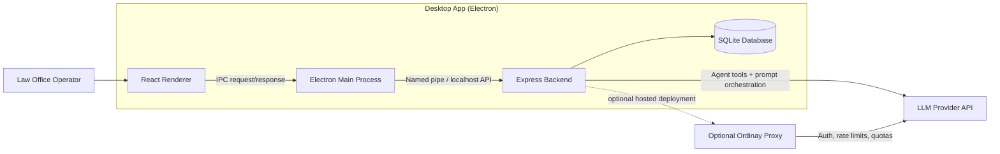
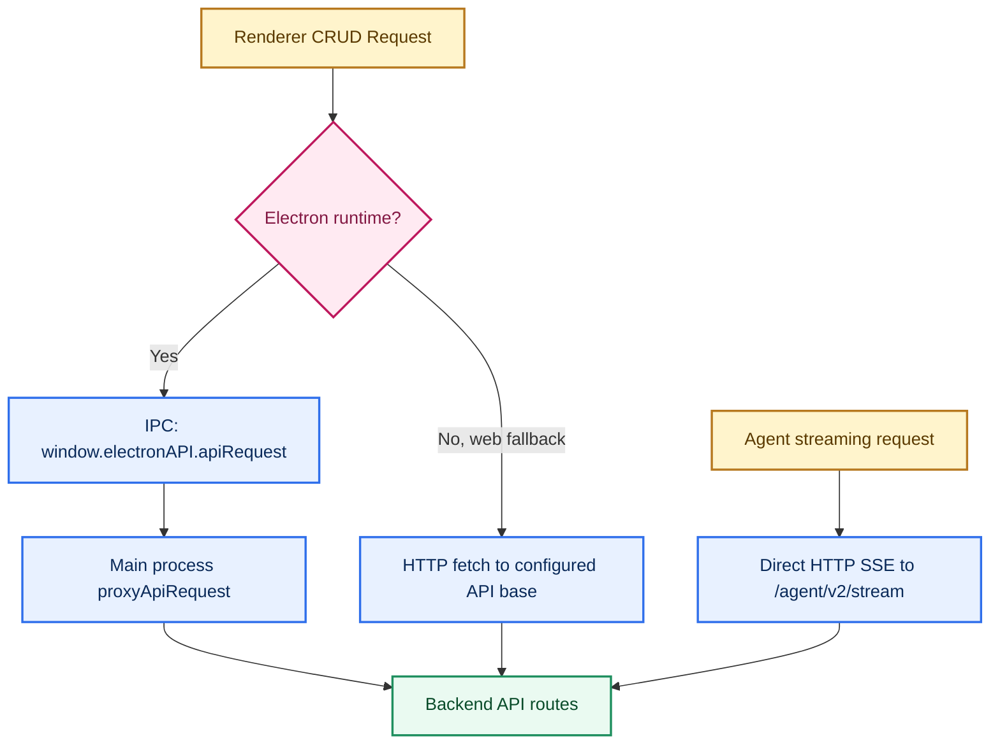
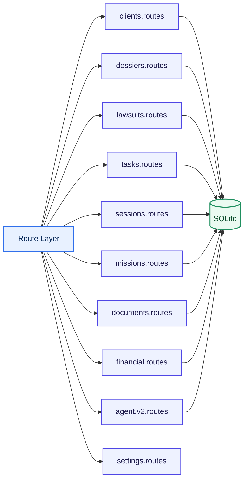
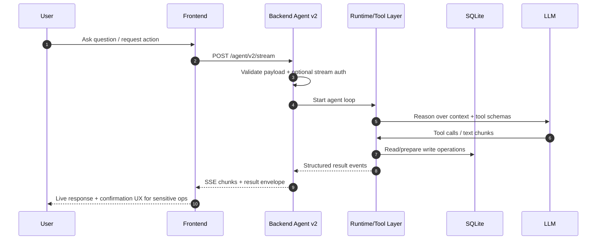
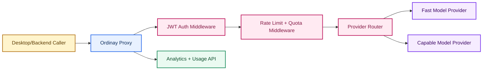

# Architecture Diagrams

## 1. System Context

## 2. Runtime Transport Logic

## 3. Backend Domain Modules

## 4. Agent V2 Safety Flow

## 5. Optional Proxy Topology

## 6. Architecture Notes

- CRUD traffic is optimized for local reliability (IPC + local backend path).
- Streaming keeps direct HTTP/SSE to preserve event flow characteristics.
- Core legal logic stays in backend/domain routes, not in UI components.
- Database constraints enforce relationship correctness even if UI validation is bypassed.
