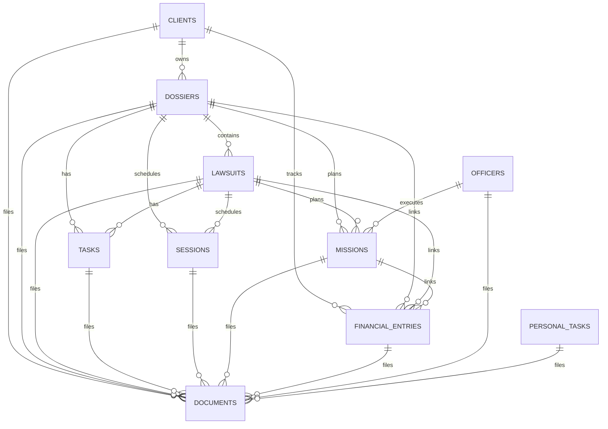
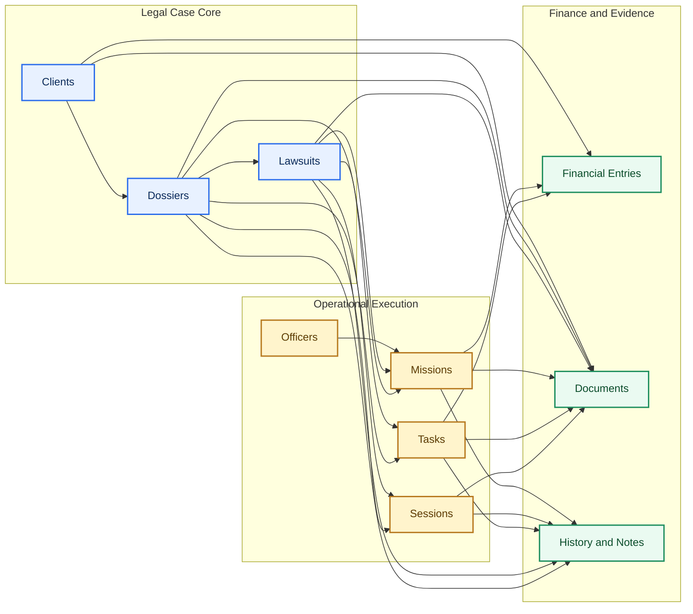

# Domain Model

This document captures the core data logic from `backend/src/db/schema.sql`.

## 1. Core Entity Relationships

## 1.1 Domain Context Groups

## 2. Logic Invariants (Critical)

1. `Task ownership XOR`  
   A `task` must belong to exactly one parent: `dossier_id` or `lawsuit_id` (not both).

2. `Session ownership XOR`  
   A `session` must link to either a dossier or a lawsuit.

3. `Mission ownership XOR`  
   A `mission` must link to either a dossier or a lawsuit.

4. `Document single-target rule`  
   A `document` must be attached to exactly one entity type.

5. `Dossier/Lawsuit status vocabularies`  
   Status and priority are constrained by strict `CHECK` sets.

6. `Protected referential integrity`  
   Most core foreign keys use `ON DELETE RESTRICT` to avoid accidental cascade loss.

## 3. Lifecycle and Traceability

- `history_events`: immutable operational trace for entity lifecycle changes.
- `notes`: contextual human notes attached to domain entities.
- `notifications` + `dismissed_notifications`: proactive reminders and dedupe logic.
- `document_chunks` + `fts_document_chunks`: searchable document intelligence layer.

## 4. Why This Design Matters

- The data model encodes legal workflow semantics, not only storage.
- Entity constraints reduce inconsistent states before application code is reached.
- Relations support both operational UI and AI/tool-assisted reasoning paths.
